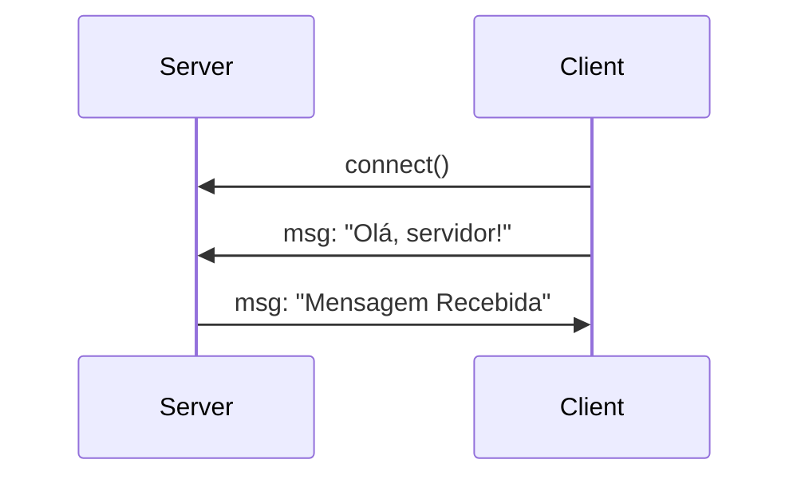
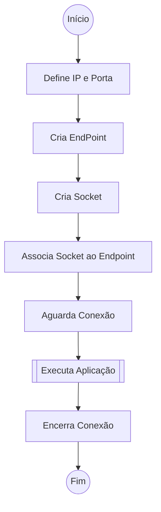
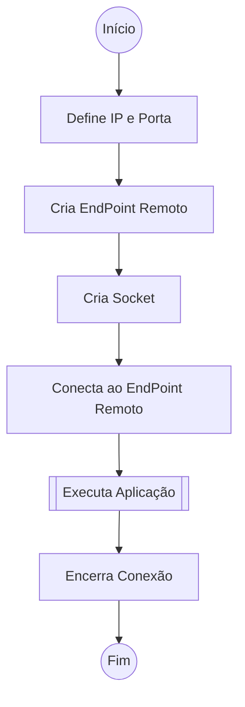

# Aula 01 - Sockets em C#

## Conteúdo Programado
1. O que é um Socket;
2. Conexão - Um par de Sockets;
3. Modelo Cliente-Servidor
4. Como criar um Socket TCP/IP em C#;
5. Como realizar a conexão com o servidor.

## 1. O que é um Socket?

Um Socket é um ponto de comunicação que permite a troca de dados entre dois dispositivos
através da rede. Ele funciona como uma porta que pode ser utilizada para enviar e receber dados.
De forma geral, um Socket é uma combinação de Endereço IP e um número de Porta que juntos
identificam de forma única um ponto de conexão.

## 2. Conexão - Um par de Sockets

O estabelecimento de uma conexão acontece com a ligação entre dois sockets, um
no dispotivo de origem e outro no dispositivo de destino.

Cada par de Sockets identifica de forma única uma comunicação. Possibilitando que um
mesmo Socket seja utilizado para diferentes conexões.

## 3. Modelo Cliente-Servidor

Nos sistemas do tipo Cliente-Servir, são desenvolvidas duas aplicações assimétricas.

O Servidor é inicializado e irá aguardar por solicitações de conexão. Quando as condições
para início do programa forem estabelecidas, o servidor dará início à partida.

A aplicação Cliente irá realizar a solicitação de conexão com o servidor. E aguardará
as orientações sobre o andamento da execução da partida.

O Diagrama de Sequência abaixo descreve a comunicação realizada pelas aplicações `SocketServer` e `SocketClient`.



## 4. Criando um Socket TCP/IP em C#

Para a Criação de um Socket em C#, devemos ficar atentos aos seguintes detalhes:

### 4.1. Namespaces

Para iniciar o nosso trabalho com Sockets, iremos adicionar os seguintes `namespaces`
ao nosso programa:

```csharp
using System;
using System.Net;
using System.Net.Sockets;
using System.Text;
```

O Socket é criado conforme o código apresentado abaixo.

```csharp
// Define um Endereço IP e a Porta
IPAddress ipAddress = IPAddress.Parse(127.0.0.1);
int port = 11000;

// Cria um endpoint de rede
IPEndPoint localEndpoint = new IPEndPoint(ipAddress, port);

// Cria um socket TCP/IP
Socket sock = new Socket(ipAddress.AddressFamily, SocketType.Stream, ProtocolType.Tcp);
```

O uso do socket varia de acordo com o tipo de aplicação que está sendo desenvolvido.

#### Servidor



#### Cliente



### 5. Como realizar a conexão com o servidor

Verifique o conteúdo dos Projetos `SocketClient` e `SocketServer` para compreender o funcionamento dos Sockets.

### 6. Exercício

1. Execute os dois projetos no mesmo computador e verifique se a comunicação ocorre de forma adequada.
2. Modifique o projeto `SocketClient` para enviar o seu nome ao invés de uma Mensagem Padrão.
3. Modifique o projeto `SocketClient` para que se conecte ao `SocketServer` executando no PC do Professor.