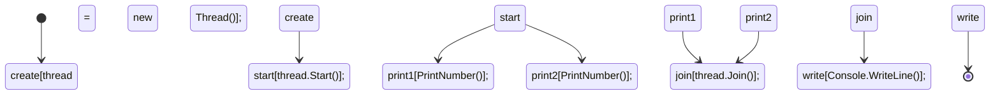

# Aula 02 - Sockets em C#

## Conteúdo Programado
1. O que são Threads?
2. Para que usar Threads na implementação do Servidor?
3. Exemplo de Thread
4. TcpListener
4. Como criar um Socket TCP/IP em C#;
5. Como realizar a conexão com o servidor.

## 1. O que são Threads?

Uma Thread é a menor unidade de execução que pode ser gerenciada pelo sistema operacional.
Em termos simples, uma thread é um caminho de execução através de um programa. Cada thread
dentro de um processo pode executar independemente, mas compartilha recursos como memória
e arquivos abertos com outras threads do mesmo processo. Isso permite a execução simultânea
de várias operações dentro de um único aplicativo, melhorando a eficiência e o desempenho,
especialmente em sistemas com múltiplos núcleos de processamento.

### 1.1. Principais Características

1. **Execução Paralela**: Permite que diferentes partes de um programa sejam executadas ao mesmo tempo.
2. **Compartilhamento de Recursos**: Threads dentro do mesmo processo compartilham a mesma memória e recursos.
3. **Leveza**: Criar e gerenciar threads consome menos recursos do que processos.
4. **Sincronização Necessária**: Devido ao compartilhamento de recursos, é necessário gerenciar o acesso concorrente para evitar condições de corrida e outros problemas.

## 2. Por quê usar Threads na implementação do Servidor?

O uso de Threads na implementação do Servidor tem como principal objetivo possibilitar que
o Sevidor atenda vários clientes simultâneamente.

Num jogo em que vário clientes podem se comunicar simultâneamente com o servidor, é necessário
que fluxos diferentes de código executem paralelamente.

## 3. Exemplo de Thread

O código a seguir mostra um exemplo de aplicação utilizando Threads.

```cs
using System;
using System.Threading;

class Program
{
static void Main()
{
// Cria uma nova thread que executa o método PrintNumbers
Thread thread = new Thread(PrintNumbers);

        // Inicia a thread
        thread.Start();
        
        // Método executado na thread principal
        PrintNumbers();
        
        // Aguarda a conclusão da thread
        thread.Join();

        Console.WriteLine("Fim do programa");
    }

    // Método que será executado pela thread
    static void PrintNumbers()
    {
        // Obtém o identificador da thread atual
        string threadId = Thread.CurrentThread.ManagedThreadId.ToString();
        
        for (int i = 1; i <= 5; i++)
        {
            Console.WriteLine($"Thread {threadId} - Número: {i}");
            // Pausa de 1 segundo entre cada número
            Thread.Sleep(1000);
        }
    }
}
```
Replique o código acima, modificando a posição de `thread.Join()` para antes da linha `PrintNumbers()`.
Explique o que aconteceu.

### 3.1. Diagrama de Sequência



## 3. TcpListener

O TcpListener é uma classe na biblioteca .NET utilizada para escutar conexões de rede TCP
em uma porta específica. Ela oferece uma maneira simplificada e de alto nível para
implementar servidores TCP, facilitando a aceitação de conexões de clientes e a
comunicação através de sockets.

### 3.1. Principais Características

1. Escuta de Conexões:
   1. Pode escutar conexões em um endereço IP e porta específicos.
   2. Fornece métodos para iniciar e parar a escuta. 
2. Aceitação de Conexões:
   1. Pode aceitar conexões de clientes de forma síncrona (AcceptTcpClient) ou assíncrona (AcceptTcpClientAsync).
   2. Retorna um objeto TcpClient que representa a conexão do cliente, permitindo a comunicação através de streams. 
3. Facilidade de Uso:
   1. Abstrai muitos dos detalhes de baixo nível do socket, proporcionando uma interface fácil de usar para criar servidores TCP.
   2. Ideal para aplicações que precisam de um servidor TCP básico e rápido de implementar.

### 3.2. Métodos Comuns:
   `Start()`: Inicia o TcpListener para começar a escutar conexões de entrada.
   `Stop()`: Para o TcpListener de escutar conexões.
   `AcceptTcpClient()`: Aceita uma conexão de cliente e retorna um TcpClient para comunicação.
   `AcceptSocket()`: Aceita uma conexão de cliente e retorna um Socket para comunicação, fornecendo maior controle sobre a comunicação de rede.

