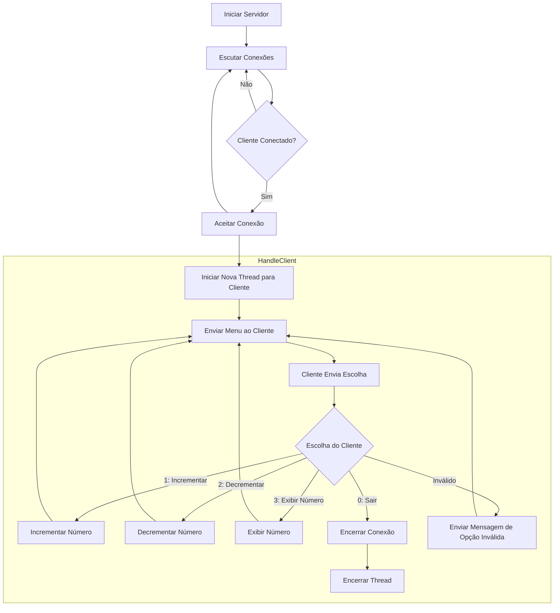

# Avaliação 01

## SharedMemoryServer
O projeto [SharedMemoryServer](./SharedMemoryServer/SharedMemoryServer/Program.cs) apresenta o código do Servidor que
utiliza memória compartilhada para interação entre as Threads.

O Fluxograma abaixo apresenta o comportamento do Código

## Tarefas:

1. Escreva o fluxograma para de um cliente que seja capaz de se comunicar com esse servidor.
2. Implemente o código do cliente descrito no seu fluxograma.
3. Escreva um relatório explicando, em detalhes, o funcionamento dos blocos de código que você utilizou.

## Avaliação:

- Fluxograma;
- Código do Cliente;
- Interação entre o Cliente e o Servidor;
- Relatório;
- Explicação/Apresentação.