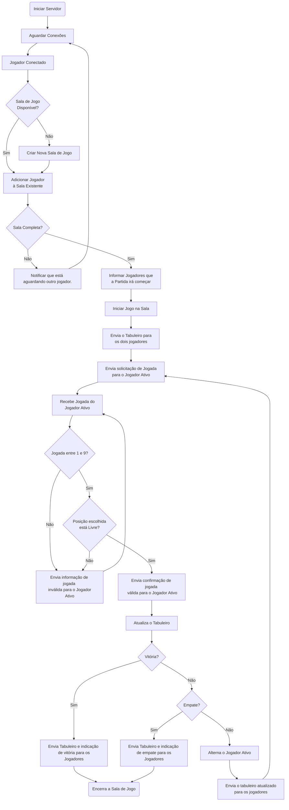

# Projeto Jogo da Velha

Nesse projeto deverá ser desenvolvido o programa cliente, compatível com o servidor apresentado, 
para o jogo da velha.

Como material para avaliação deverá ser apresentado:

- Relatório contendo:
  - Fluxograma para a aplicação cliente;
  - Descrição do código-fonte correspondente a cada bloco do diagrama;
- Repositório do GitHub com o código da aplicação desenvolvida.

## Servidor

Nesta seção serão apresentadas as características de funcionamento do servidor disponibilizado. É importante compreender bem o funcionamento do servidor para desenvolver um cliente capaz de interagir corretamente com ele.

### Características

- O Servidor irá aguardar solicitações de conexão dos clientes e os organizará em Salas de Jogo conforme a ordem de conexão.
- O Servidor irá aguardar conexões na porta 13000.
- Cada Sala de Jogo abrigará 2 jogadores (duas conexões simultâneas) que irão interagir naquela partida.
- O primeiro jogador e se conectar será o primeiro a jogar.
- O Servidor irá coordenar o fluxo de comunicação, enviando as informações necessárias para cada cliente, e aguardando respostas.
- O Servidor será responsável pela manutenção do tabuleiro de jogo e pela integridades das informações contidas nele.
- O Servidor irá identificar condições de finalização do jogo (vitória de um dos jogadores ou não haver mais espaços disponíveis para jogadas).

### Fluxograma

O Fluxograma a seguir apresenta o comportamento do servidor.

### Mensagens

