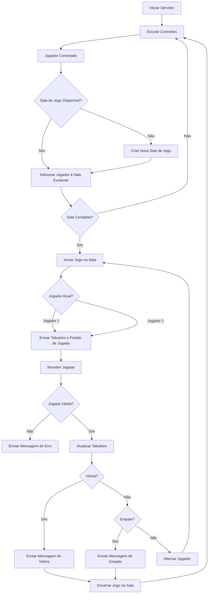

# Projeto Jogo da Velha

Nesse projeto deverá ser desenvolvido o programa cliente, compatível com o servidor apresentado, 
para o jogo da velha.

Como material para avaliação deverá ser apresentado:
 
 - Relatório contendo:
   - Fluxograma para a aplicação cliente;
   - Descrição do código fonte correspondente a cada bloco do diagrama;
 - Repositório do GitHub com o código da aplicação desenvolvida.

## Servidor

### Fluxograma
