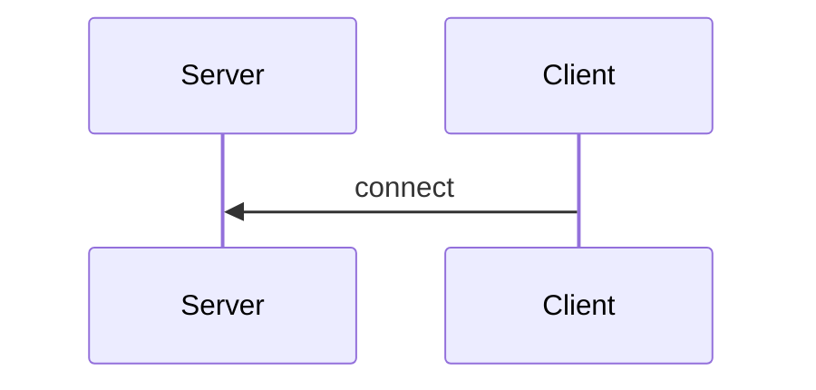

# Aula 01 - Sockets em C#

## Conteúdo Programado
1. O que é um Socket;
2. Conexão - Um par de Sockets;
3. Modelo Cliente-Servidor
4. Como criar um Socket TCP/IP em C#;
5. Como realizar a conexão com o servidor.

## 1. O que é um Socket?

Um Socket é um ponto de comunicação que permite a troca de dados entre dois dispositivos
através da rede. Ele funciona como uma porta que pode ser utilizada para enviar e receber dados.
De forma geral, um Socket é uma combinação de Endereço IP e um número de Porta que juntos
identificam de forma única um ponto de conexão.

## 2. Conexão - Um par de Sockets

O estabelecimento de uma conexão acontece com a ligação entre dois sockets, um
no dispotivo de origem e outro no dispositivo de destino.

Cada par de Sockets identifica de forma única uma comunicação. Possibilitando que um
mesmo Socket seja utilizado para diferentes conexões.

## 3. Modelo Cliente-Servidor

Nesta aula, iremos criar aplicações do tipo Cliente-Servidor. Nesse modelo de comunicação,
há duas aplicações distintas que são capazes de se conectar e trocarem informações. 

