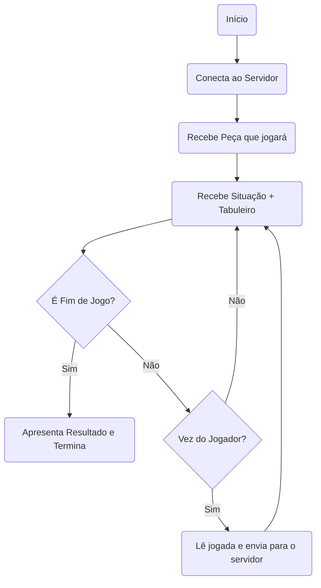

# Avaliação de Programação de Jogos em Rede
Nesta avaliação, você deverá implementar um cliente em C/C++ que interaja com o ``server.py``.

O cliente deverá implementar o seguinte fluxo de comunicação e ações:

## Configurações do servidor:

* O Servidor estará executando na porta 8080;

## Formato da mensagem

As mensagens do servidor seguirão o seguinte formato:
* ``"O---------"``: É vez do jogador ``O`` jogar e o tabuleiro possui a configuração ``---------``;
* ``"XO-X------"``: É vez do jogador ``X`` jogar e o tabuleiro possui a configuração ``O-X------``;
* ``"VOOOOXX----"``: Vitória do Jogador ``O`` e o tabuleiro e o tabuleiro possui a configuração ``OOOXX----``;
* ``"VXOXOOXX-XO"``: Vitória do Jogador ``X`` e o tabuleiro e o tabuleiro possui a configuração ``OXOOXX-XO``;
* ``"EXOOXXOOXX"``: O Jogo terminou empatado e o tabuleiro possui a seguinte configuração ``XOOXXOOXX``;