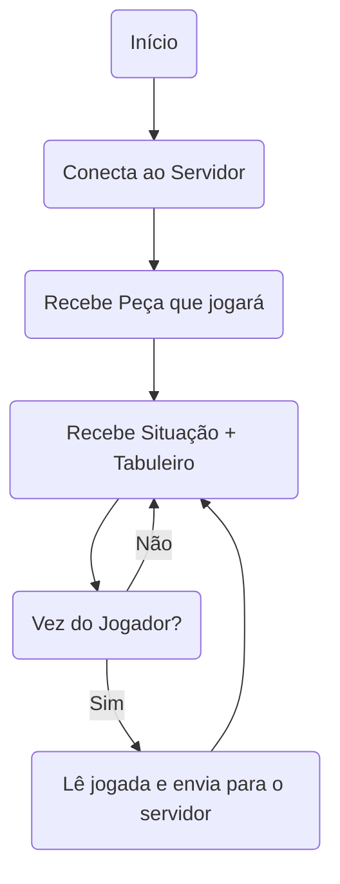

# Avaliação de Programação de Jogos em Rede
Nesta avaliação, você deverá implementar um cliente em C/C++ que interaja com o ``server.py``.

O cliente deverá implementar o seguinte fluxo de comunicação e ações:

